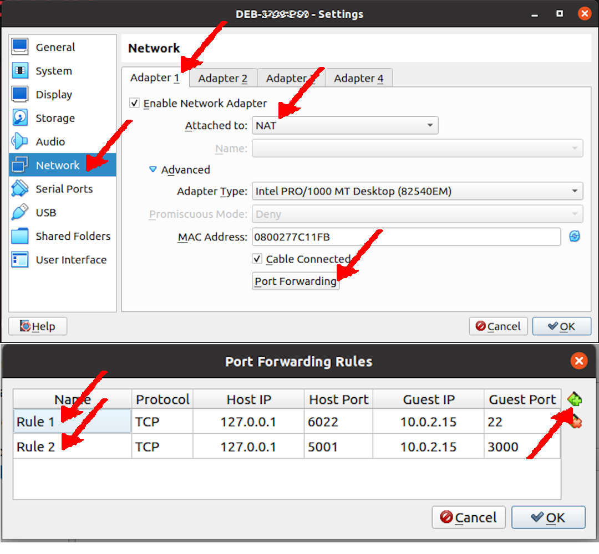
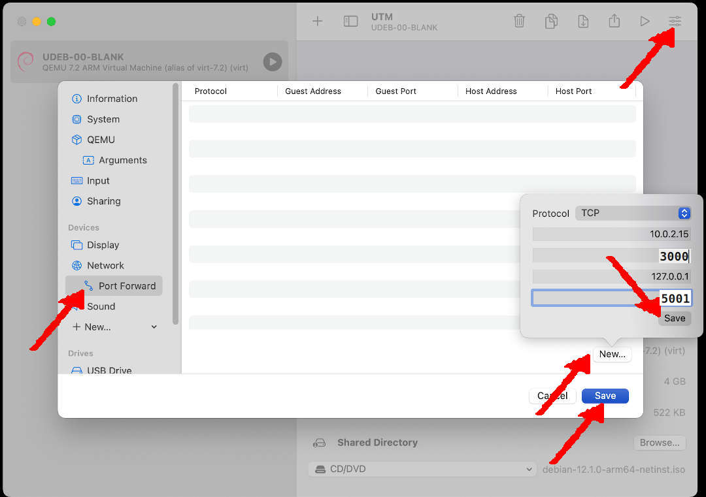

# 251docs by BinKadal, Sdn, Bhd.

[&#x213C;](#idxXXX)<br id="idx000">
## Table of Content (Toc)
* [Network Address Translation (NAT) Settings](#idx001)
  * [VirtualBox](#idx001)
  * [UTM](#idx001a)
* [GitHub Repo 251docs](#idx002a)
  * [File .gitignore](#idx002)
* [Debian Packages](#idx003)
* [Removed Packages](#idx004)
* [Install NVM/node.js](#idx005)
  * [Remove Old Node.js](#idx006)
  * [Install Node.js](#idx007)
  * [Remove Old Node.js](#idx008)
* [YARN](#idx009)
* [Install Docusaurus](#idx010)
* [Test Docusaurus (local)](#idx012)
* [docusaurus.config.js](#idx011)
* [Deploy To GitHub](#idx013)
* [ETC](#idx014)
* [More Links](#idx015)

[&#x213C;](#)<br id="idx001">
## Network Address Translation (NAT) Settings

### VirtualBox

MkDocs is using local port 8000. 
On your VirtualBox, you must redirect/translate the local port 8000 to the host port 4999.
I am already using 5000 for Jekyll and 5001 for Docusaurus.

* VirtualBox Settings
  * Network:Adapter1:
    * Enable Network Adapter
    * Attached to: NAT
    * Port Forwarding:
      * 127.0.0.1:4999 (Host) --- 10.0.2.15:8000 (Guest)

<br><br>

[&#x213C;](#)<br id="idx001a">

### UTM

MkDocs is using local port 8000. 
On your UTM, you must redirect/translate the local port 8000 to the host port 4999.
I am already using 5000 for Jekyll and 5001 for Docusaurus.

* UTM Settings
  * Network Mode: Emulated VLAN
    * Port Forward: New
      * Protocol: TCP
      * Guest Address: 10.0.2.15
      * Guest Port: 8000
      * Host Address: 127.0.0.1
      * Host Port: 4999
   * SAVE

<br><br>

[&#x213C;](#)<br id="idx002a">
## GitHub Repo 251docs

* Create a new [GitHub](https://github.com/) repo.
  * New Repository
  * Repository Name: "251docs"
  * Description: "251docs"
  * Public
  * Add README.md
  * Add .gitignore: Python (temporary)
  * Choose any free LICENSE
  * See also <https://doit.vlsm.org/030.html>
* Create a GitHub page.
  * (Create branch: gh-pages), apparently will automatically create a GitHub Page?!
  * See also <https://doit.vlsm.org/031.html>
* CLONE Your GitHub Repo on VirtualBox. E.g.

```
git clone git@github.com:cbkadal/251docs.git

```
* REMEMBER: You are not **CBKADAL**!
* Write your memo on file "README.md".
  * Update/push "README.md" regularly.

[&#x213C;](#)<br id="idx002">
### File .gitignore

Don't push the node.js files to GitHub! 
If you missed the .gitignore file option during the repo initialization process, 
copy the following into your .gitignore file:
https://raw.githubusercontent.com/cbkadal/251docs/master/.gitignore

[&#x213C;](#)<br id="idx003">
## Debian Packages (root)

Make sure the following Debian packages are present in your system.

```
# ROOT privilege.
export DEBS="
aptitude
build-essential
git
libffi-dev
libssl-dev
python3
python3-dev
python3-pip
python3-venv
sudo
vim
"
date;
time apt-get install $DEBS -y

```

[&#x213C;](#)<br id="idx004">
## Removed Packages (root)
Remove the current "yarn" version used by the Jekyll installation. It will be replaced with a newer one.
That old "yarn" is in the "cmdtest" package.

```
# ROOT privilege.
aptitude purge cmdtest

```

[&#x213C;](#)<br id="idx005">
## Install NVM/node.js (user)
Docusaurus needs a huge JavaScript runtime environment package called "node.js." 
Check https://github.com/nvm-sh/nvm/releases for the latest NVM package release. 
Currently, it is version 0.40.1.

```
# USER privilege.
NVM_RELEASE="v0.40.1"
wget -qO- https://raw.githubusercontent.com/nvm-sh/nvm/$NVM_RELEASE/install.sh | bash

```

### Close (exit) and reopen your terminal to start using nvm!
* One more time: close (exit) and reopen your terminal to start using nvm!
* Have I told you to close (exit) and reopen your terminal to start using nvm?

[&#x213C;](#)<br id="idx006">
### Check Node.js Version (user)

Check for the latest LTS (Long-Term Support) version.

```
# USER privilege.
nvm ls-remote

```

You might have previously installed node.js before. For example,
* the latest LTS version (NEW_NODE_VERSION) is "v20.18.0"
* the current installed version (OLD_NODE_VERSION) is "v20.11.1"


[&#x213C;](#)<br id="idx007">
### Install Node.js (user)

Set NEW_NODE_VERSION

```
# USER privilege.
NEW_NODE_VERSION="v20.18.0"
nvm install $NEW_NODE_VERSION
nvm alias default $NEW_NODE_VERSION
sleep 1
node -v

```

[&#x213C;](#)<br id="idx008">
### Remove Old Node.js (if exists)

You might have installed node.js before (e.g. v20.11.1).
Remove the old "node.js" if you wish.

```
# USER privilege.
OLD_NODE_VERSION="v20.11.1"
nvm uninstall $OLD_NODE_VERSION
sleep 1
rm -rfv $HOME/.nvm/versions/node/$OLD_NODE_VERSION/
node -v

```

[&#x213C;](#)<br id="idx009">
## Install YARN (user)

```
# USER privilege.
npm install -g yarn
sleep 2
yarn --version

```

[&#x213C;](#)<br id="idx009a">
### Check UPDATE

```
# USER privilege.
npm outdated

```

[&#x213C;](#)<br id="idx009b">
### Example: Update npm 10.9.0

```
# USER privilege.
npm install -g npm@10.9.0

```

[&#x213C;](#)<br id="idx010">
## Install Docusaurus (user)

Go to your "251docs/" (repo) folder.

```
# USER privilege.
npx create-docusaurus@latest Docusaurus classic --typescript

```

[&#x213C;](#)<br id="idx012">
## Start Docusaurus (local)

Test if Docusaurus shows on port 5001 (host).

```
# USER privilege.
cd Docusaurus/
npm run start -- --host 0.0.0.0

```


[&#x213C;](#)<br id="idx011">
## File docusaurus.config.ts

Goto (cd) folder "Docusaurus/" and edit file "docusaurus.config.ts".
Remember, you are not "cbkadal".

```
  title: '251docs',               // Or else
  tagline: 'This is the Way!',      // Or else
  favicon: 'img/favicon.ico',       // Or else
  url: 'https://cbkadal.github.io', // Or else
  baseUrl: '/251docs/',           // Or else
  organizationName: 'cbkadal',      // (Usually your GitHub org/user name)
  projectName: '251docs',         // (Usually your repo name)
  trailingSlash: true,              // "true" or "false"

```

[&#x213C;](#)<br id="idx013">
## Deploy To GitHub

Replace "GIT_USER" because you are not "cbkadal"!

```
# USER privilege.
export GIT_USER="cbkadal"
export USE_SSH="true"
yarn deploy

```

[&#x213C;](#)<br id="idx014">
## ETC

### Restore From GitHub

```
# USER privilege.
# Inside repo "251docs/"
cd Docusaurus/
npm install

```

### Image Plugin

```
# USER privilege.
npm install --save @docusaurus/plugin-ideal-image

```

### Raw Loader

```
# USER privilege.
npm install --save raw-loader

```

### Fix

```
# USER privilege.
npm audit fix

```

### UPGRADE DOCUSAURUS
                                                                                                                  
To upgrade Docusaurus packages with the latest version, run the following command:    

``` 
# @docusaurus/module-type-aliases@latest
# USER privilege.
npm i @docusaurus/core@latest @docusaurus/plugin-ideal-image@latest @docusaurus/preset-classic@latest \
      @docusaurus/tsconfig@latest @docusaurus/types@latest
npm audit fix

```

[&#x213C;](#)<br id="idx015">
## More Links

* <https://docusaurus.io/docs/>

[&#x213C;](#)<br id="idxXXX"><br>


### ########################################################


sudo apt install -y \

python --version
pip --version
python -m venv --help

# CREATE AND CLONE REPO
git clone REPO

# A centralized ".virtualenvs/" directory
mkdir -pv ~/.virtualenvs/

# Create a virtual environment
python3 -m venv ~/.virtualenvs/$(basename $(pwd))

# Activate the virtual environment
source ~/.virtualenvs/$(basename $(pwd))/bin/activate

# Upgrading the virtual environment’s pip
~/.virtualenvs/$(basename $(pwd))/bin/python -m pip install --upgrade pip

# Check the version
pip --version

# install MkDocs and additional MkDocs plugins
pip install mkdocs mkdocs-material

# Clean UP
pip cache purge

# Verify Version
mkdocs --version

# Create a docs/ Directory
mkdir -pv docs/
cd docs/
mkdocs new .

# Test from VirtualBox
mkdocs serve --dev-addr=0.0.0.0:8000

# Build the MkDocs site
mkdocs build

# Create and switch to a clean gh-pages branch for the first time
git checkout --orphan gh-pages

# Switch to a clean gh-pages branch
git checkout gh-pages


# Remove all files from the gh-pages branch:
git rm -rf .
cp -rv site/* ../
cd ../
git rm -rf docs/
git add .
git commit -m "Deploy MkDocs site"
git push origin gh-pages


<hr>

```
REVISI: Thu 28 Nov 2024 22:00
REVISI: Tue 26 Nov 2024 18:00
STARTX: Tue 26 Nov 2024 12:00
```

