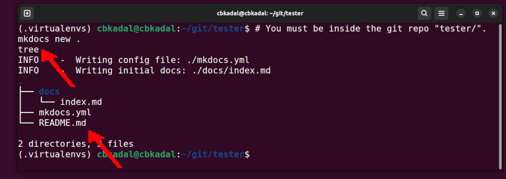

## Create MkDocs inside repo "tester/"

* Check the file tree

```
# You must be inside the git repo "tester/".
mkdocs new .
tree

```

{ width=95% }

## Test from VirtualBox

```
# Check HOST at "localhost:4999" (HOST)
mkdocs serve --dev-addr=0.0.0.0:8000

```

## File: mkdocs.yml 

Replace file "mkdocs.yml" with the following.

```yaml


```

## Create Some Dummy Files

```bash
mkdir -pv assets/  configs/  img/  static/
touch about.md  Debs.md  GitHub.md  index.md  listing.md  MkDocs.md  NAT_settings.md  Python.md
touch assets/styles.css configs/{gitignore,mkdocs.yml} static/hello.c
touch img/{cbkadal.jpg,dummy.jpg,mkdocs-new.jpg,venv.jpg,debM1-forward.jpg,favicon.ico,VBOX-NAT.jpg,vrtass.jpg}

```
 
## Build the MkDocs site
* Build, commit, and push (master)

```
git add .
git commit -m "Save uncommitted changes"
git push

```

## Deploy and Check Local

```
mkdocs gh-deploy --force --clean
git checkout gh-pages
mkdocs serve --dev-addr=0.0.0.0:8000

```

* Checkit out at <https://vrtass.github.io/tester/>{:target="_blank"}, but your are not VRTASS!
* Replace all the dummy files.

<hr>

```
REVISI: Tue 03 Dec 2024 22:00
REVISI: Tue 03 Dec 2024 21:00
STARTX: Tue 03 Dec 2024 20:00
```

