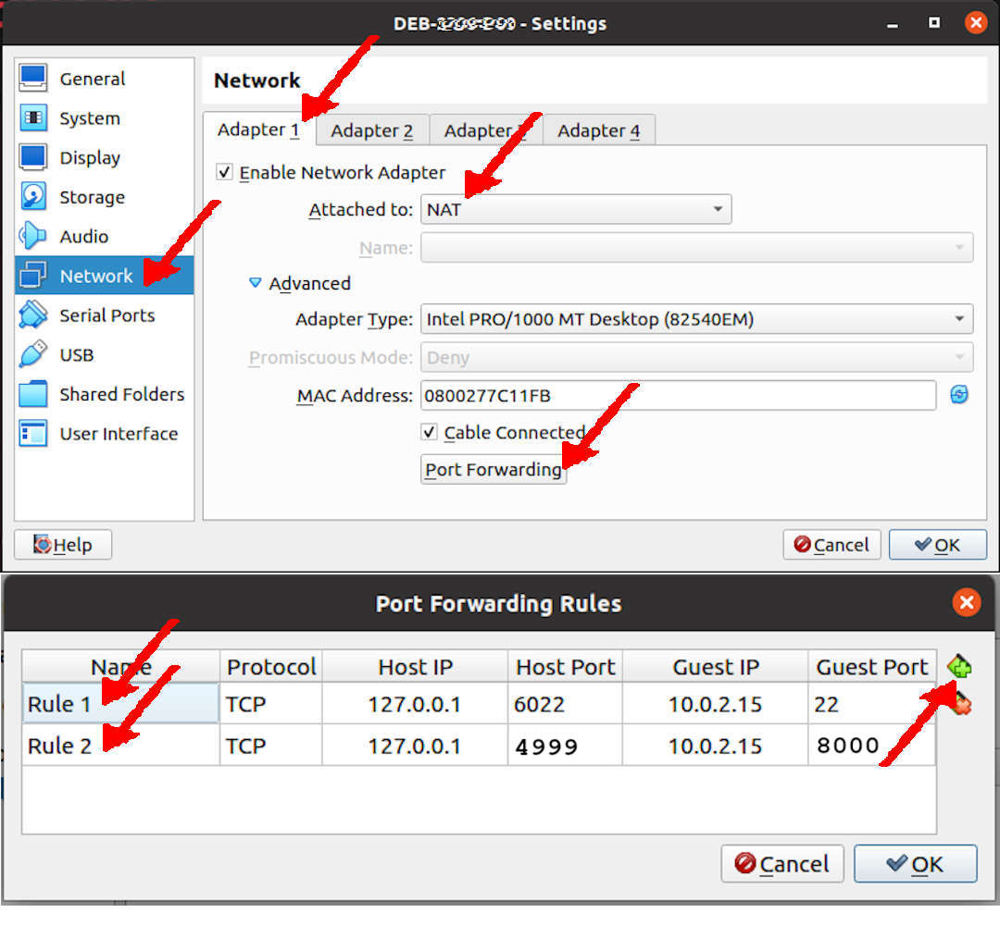
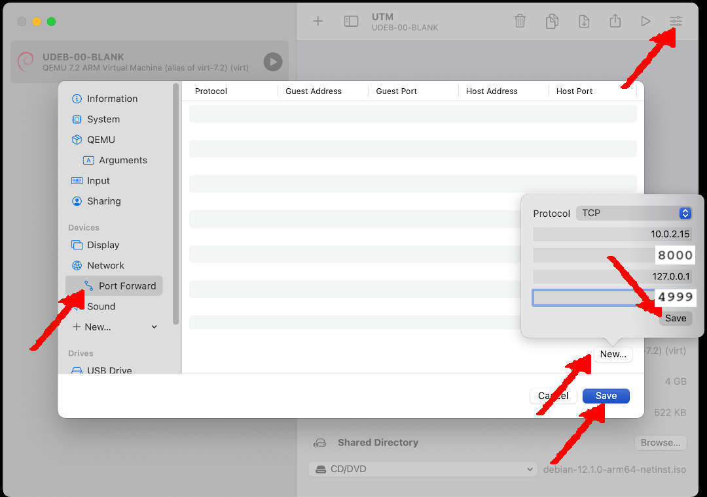

## Network Address Translation (NAT) Settings

### VirtualBox

MkDocs is using local port 8000. 
On your VirtualBox, you must redirect/translate the local port 8000 to the host port 4999
because I already use 5000 for Jekyll and 5001 for Docusaurus.

* VirtualBox Settings
  * Network:Adapter1:
    * Enable Network Adapter
    * Attached to: NAT
    * Port Forwarding:
      * 127.0.0.1:4999 (Host) --- 10.0.2.15:8000 (Guest)

{ width=95% }

### UTM

MkDocs is using local port 8000. 
On your UTM, you must redirect/translate the local port 8000 to the host port 4999
because I already use 5000 for Jekyll and 5001 for Docusaurus.

* UTM Settings
  * Network Mode: Emulated VLAN
    * Port Forward: New
      * Protocol: TCP
      * Guest Address: 10.0.2.15
      * Guest Port: 8000
      * Host Address: 127.0.0.1
      * Host Port: 4999
   * SAVE

{ width=95% }

```
STARTX: Tue 03 Dec 2024 17:00
```

