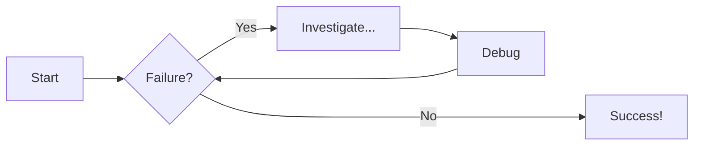
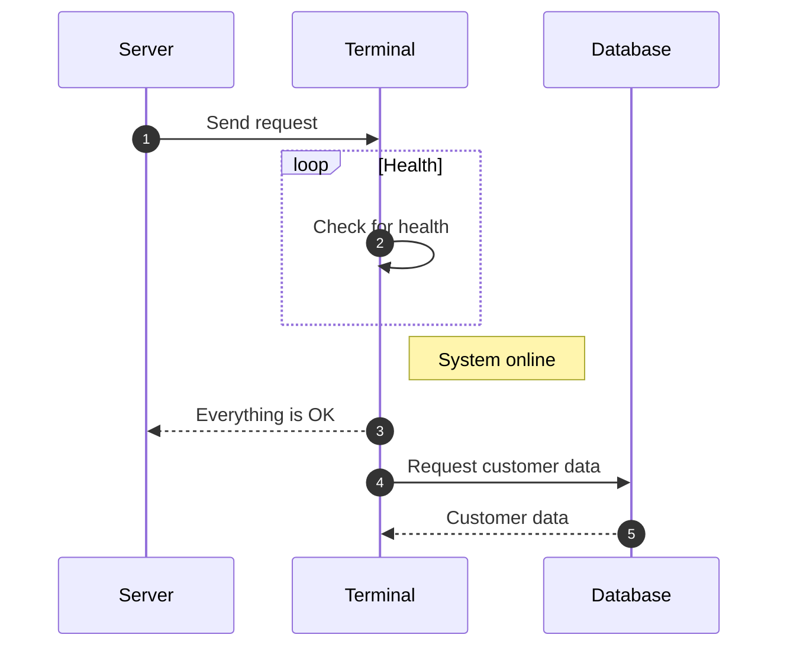

# Examples

## Custom Variable
   {{ custom_variable }}.

> Gressu si fontibus Phrygios audire iussa tremensque regis. 
> quaesitae innixa, rebus portenditur, adhuc
> alii reges quam facto illud iuvenci. Fuerim nobiliumque, mota fratrum: dives
> raptamque fuga inmensum movent nece faciemque non.

* XYZZY
    * Sub XYZZY
        * Sub Sub

## Python

```py title="add_numbers.py" 
# Function to add two numbers
def add_two_numbers(num1, num2):
    return num1 + num2

# Example usage
result = add_two_numbers(5, 3)
print('The sum is:', result)

```

## Line Numbers

```py title="add_numbers.py" linenums="1"
# Function to add two numbers
def add_two_numbers(num1, num2):
    return num1 + num2

# Example usage
result = add_two_numbers(5, 3)
print('The sum is:', result)

```

## Highlights

```js title="code-examples.md" linenums="1" hl_lines="2-4"
// Function to concatenate two strings
function concatenateStrings(str1, str2) {
  return str1 + str2;
}

// Example usage
const result = concatenateStrings("Hello, ", "World!");
console.log("The concatenated string is:", result);

```

## Code Blocks in Content Tabs

=== "Python"

    ```py
    def main():
        print("Hello world!")

    if __name__ == "__main__":
        main()

    ```

=== "JavaScript"

    ```js
    function main() {
        console.log("Hello world!");
    }

    main();

    ```

## Admonitions (aka Callouts)

!!! note "Title of the callout"

    Lorem ipsum dolor sit amet, consectetur adipiscing elit. Nulla et euismod
    nulla. Curabitur feugiat, tortor non consequat finibus, justo purus auctor
    massa, nec semper lorem quam in massa.


Collapsible callout:

??? info "Collapsible callout"

    Lorem ipsum dolor sit amet, consectetur adipiscing elit. Nulla et euismod
    nulla. Curabitur feugiat, tortor non consequat finibus, justo purus auctor
    massa, nec semper lorem quam in massa.

### Flowcharts



### Sequence Diagrams



### Include

```c


```

!!! note "Revision:"
    <pre>
    REVISI: Thu 05 Dec 2024 17:00
    REVISI: Tue 03 Dec 2024 23:00
    REVISI: Tue 03 Dec 2024 18:00
    REVISI: Tue 03 Dec 2024 11:00
    STARTX: Tue 03 Dec 2024 09:00
    </pre>

