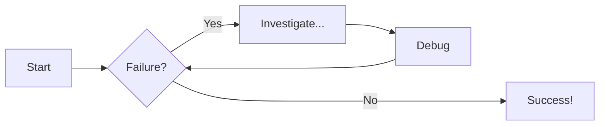
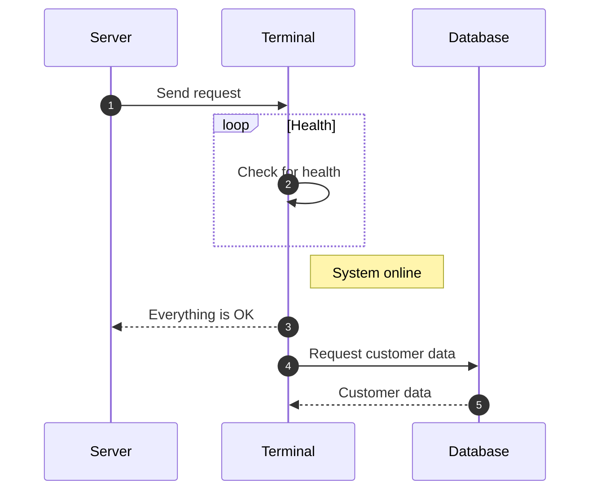

# Examples

## Image

{: style="float: left; margin: 3px 20px 3px 3px; width: 110px;"}
Examples are taken from Here, There, and Everywhere, including from:
James Willett's YouTube channel.

## Admonitions

!!! note note
    note

!!! success "More Admonitions"
    abstract, bug, danger, example, failure, info, note, question, quote, success, tip, warning.

??? info "Collapsible Callout of Emojis"
    :airplane: :alien: :anger: :anchor:
    :angry: :astonished: :bat: :blush: :bone: :camel: :clap_tone1: :cry: :dizzy_face: 
    :disappointed: :expressionless: :face_vomiting: :fearful: 
    :flag_id: :flushed: :fork_and_knife: :grinning:
    :grin: :heart_eyes: :innocent: :joy: :kissing: :kissing_closed_eyes:
    :kissing_heart: :kissing_smiling_eyes: :laughing: :mask: :neutral_face: :ninja: :no_entry:
    :no_mouth: :partying_face: :pensive: :rage: :relaxed:
    :rofl: :sauropod: :scream: :simple-android: :sleeping: :sleepy: :slightly_smiling_face: 
    :smile: :smirk: :sneezing_face: :star: :star_and_crescent:
    :stuck_out_tongue: :stuck_out_tongue_closed_eyes:
    :stuck_out_tongue_winking_eye: :sunglasses: :upside_down_face: :weary:
    :yum: :zany_face:

## Code Blocks

### Line Numbers

```py title="add_numbers.py" linenums="1"
# Function to add two numbers
def add_two_numbers(num1, num2):
    return num1 + num2

# Example usage
result = add_two_numbers(5, 3)
print('The sum is:', result)
```

### Line Numbers and HighLight

```py title="add_numbers.py" linenums="1" hl_lines="1-3"
# Function to add two numbers
def add_two_numbers(num1, num2):
    return num1 + num2

# Example usage
result = add_two_numbers(5, 3)
print('The sum is:', result)
```

### No Line Numbers

```py title="add_numbers.py"
# Function to add two numbers
def add_two_numbers(num1, num2):
    return num1 + num2

# Example usage
result = add_two_numbers(5, 3)
print('The sum is:', result)
```

### Code Blocks in Content Tabs

=== "Python"

    ```py
    def main():
        print("Hello world!")

    if __name__ == "__main__":
        main()

    ```

=== "JavaScript"

    ```js
    function main() {
        console.log("Hello world!");
    }

    main();

    ```
=== "C"

    ```c title="hello.c"
    

    ```
=== "Bash"

    ```bash
    #!/bin/bash
    echo "Hello World"

    ```

## Custom Variable
   {{ custom_variable }}.


## Block Quote Border

> Gressu si fontibus Phrygios audire iussa tremensque regis. 
> quaesitae innixa, rebus portenditur, adhuc
> alii reges quam facto illud iuvenci. Fuerim nobiliumque, mota fratrum: dives
> raptamque fuga inmensum movent nece faciemque non.

## List
* Level 1
    * Level 2
        * Level 3
            * Level 4

## Charts

### Flowcharts



### Sequence Diagrams



??? info "REVISION: Thu 05 Dec 2024 20:00"
    <pre>
    REVISION: Thu 05 Dec 2024 20:00
    REVISION: Thu 05 Dec 2024 17:00
    REVISION: Tue 03 Dec 2024 23:00
    REVISION: Tue 03 Dec 2024 18:00
    REVISION: Tue 03 Dec 2024 11:00
    STARTING: Tue 03 Dec 2024 09:00
    </pre>

