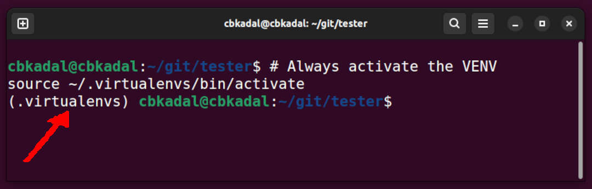

# MkDocs for a Debian on VirtualBox/UTM


This [GitHub Page](https://pages.github.com/){:target="_blank"} is hosted at [GitHub.com]({{ github_url }}){:target="_blank"}.
For full documentation visit [mkdocs.org](https://www.mkdocs.org){:target="_blank"}.
And remember, you are not {{ extra.seo.author }}!

<p style="text-align: right;">
--- {{ extra.seo.author }}
</p>
<hr>

## Network Address Translation (NAT) Settings

### VirtualBox

MkDocs is using local port 8000. 
On your VirtualBox, you must redirect/translate the local port 8000 to the host port 4999
because I already use 5000 for Jekyll and 5001 for Docusaurus.

* VirtualBox Settings
  * Network:Adapter1:
    * Enable Network Adapter
    * Attached to: NAT
    * Port Forwarding:
      * 127.0.0.1:4999 (Host) --- 10.0.2.15:8000 (Guest)

{ width=95% }

### UTM

MkDocs is using local port 8000. 
On your UTM, you must redirect/translate the local port 8000 to the host port 4999
because I already use 5000 for Jekyll and 5001 for Docusaurus.

* UTM Settings
  * Network Mode: Emulated VLAN
    * Port Forward: New
      * Protocol: TCP
      * Guest Address: 10.0.2.15
      * Guest Port: 8000
      * Host Address: 127.0.0.1
      * Host Port: 4999
   * SAVE

{ width=95% }

## GitHub Repo Setting

I prefer to start from GitHub so the results can be cloned.

### New GitHub Repo (GitHub Site)

Create a new repo according to your respective faith and beliefs. 
I am using user "vrtass" and creating a new repo "tester" in this example.

* Create a new [GitHub](https://github.com/){:target="_blank"} repo.
    * New Repository
    * Repository Name: "tester"
    * Description: "tester"
    * Public
    * Add README.md
    * Add .gitignore: Python (temporary)
    * Choose any free LICENSE
    * See also <https://doit.vlsm.org/030.html>{:target="_blank"}
* Create a GitHub page.
    * There is no need to do anything since the branch "gh-pages" will automatically create a GitHub Page?!

### Clone Repo on Your Debian

I am using user "vrtass" and creating a new repo "tester" in this example.
Remember, <span class="red-text">YOU ARE NOT VRTASS!</span>

```test
# You are not "vrtass:, replace GITHUB variable  with your own repo!
GITHUB="vrtass"

```
```test
# You might want to replace "tester" with any other repo name.
REPO="tester"

```

```bash
# Make sure, you have the proper GITHUB and REPO variable!
git clone git@github.com:$GITHUB/$REPO.git
cd $REPO/

```

### File .gitignore

This is an example of a ".gitignore" file.

```yaml


```

## Deb Packages

Make sure the following Debian packages are present in your system.

```
# USER privilege.
export DEBS="
aptitude
build-essential
git
libffi-dev
libssl-dev
python3
python3-dev
python3-pip
python3-venv
sudo
tree
vim
wget
"
time sudo apt-get install $DEBS -y
date

```


## Check Python, Pip, and Venv

What is the current version?

```
python --version
pip --version
python -m venv --help

```

## Python Virtual Environment

A Python virtual environment is used for dependency isolation, 
avoidance of global installation, management of different Python versions, 
simplified dependency management, cleaner development environment, 
version control compatibility, and security.

```
# A centralized ".virtualenvs/" directory
mkdir -pv ~/.virtualenvs/

# Create a Virtual Environment
python3 -m venv ~/.virtualenvs/

```

## Activate the Virtual Environment
* Before working with "MkDocs", always activate the virtual environment!

```
# Always activate the VENV
source ~/.virtualenvs/bin/activate
tree

```

Once activated, you should see the name of the virtual environment in your terminal prompt, e.g.
**"(.virtualenvs) cbkadal@cbkadal:~/git/tester$ "**

{ width=95% }


## Install MkDocs and additional MkDocs plugins

* Do not forget to activate the virtual environment!

```
# Upgrade, Clean Up, and Verify Version
pip install --upgrade          \
pip                            \
mkdocs                         \
mkdocs-awesome-pages-plugin    \
mkdocs-include-markdown-plugin \
mkdocs-macros-plugin           \
mkdocs-material                \
pymdown-extensions             \

echo "= ======================================="
pip --version
mkdocs --version
pip cache purge

```


## Create MkDocs inside repo "tester/"

* Check the file tree

```
# You must be inside the git repo "tester/".
mkdocs new .
tree

```

{ width=95% }

## Test from VirtualBox

```
# Check HOST at "localhost:4999" (HOST)
mkdocs serve --dev-addr=0.0.0.0:8000

```

## File: mkdocs.yml 

Replace file "mkdocs.yml" with the following.

```yaml


```

## Create Some Dummy Files

```bash
mkdir -pv assets/ configs/ img/ static/
touch examples.md assets/styles.css configs/{gitignore,mkdocs.yml} static/hello.c

```
 
## Build the MkDocs site
* Build, commit, and push (master)

```
git add .
git commit -m "Save uncommitted changes"
git push

```

## Deploy and Check Local

```
mkdocs gh-deploy --force --clean
mkdocs serve --dev-addr=0.0.0.0:8000

```

* Checkit out at <https://vrtass.github.io/tester/>{:target="_blank"}, but your are not VRTASS!
* Replace all the dummy files.

<hr>


<hr>
## Links

* [mkdocs.org](https://www.mkdocs.org){:target="_blank"}
* [GitHub Repo](https://github.com/vrtass/tester){:target="_blank"}
* [Getting Started with Material for MkDocs](https://jameswillett.dev/getting-started-with-material-for-mkdocs/){:target="_blank"}
* [YouTube](https://youtu.be/xlABhbnNrfI){:target="_blank"}
* [Supporting Materials](https://github.com/james-willett/material-mkdocs-youtube-2024){:target="_blank"}

## DISCLAIMER
**This is the WAY!** This template is mainly written for **OWN PURPOSES**, it will be helpful in the future.
It is based on "_Google There, Google Here, Try That, Try This, Then Ask._"
Whether this is **PLAGIARY** or **RESEARCH**, 
there has never been a claim that this is an original work, 
nor is it necessarily the best solution, and not for Scopus consumption :).
You might provide feedback on alternative ideas. 

!!! note "Revision:"
    <pre>
    REVISI: Thu 05 Dec 2024 16:00
    REVISI: Tue 03 Dec 2024 23:00
    REVISI: Tue 03 Dec 2024 16:00
    REVISI: Mon 02 Dec 2024 21:00
    REVISI: Mon 02 Dec 2024 20:00
    STARTX: Sun 01 Dec 2024 01:00
    </pre>

